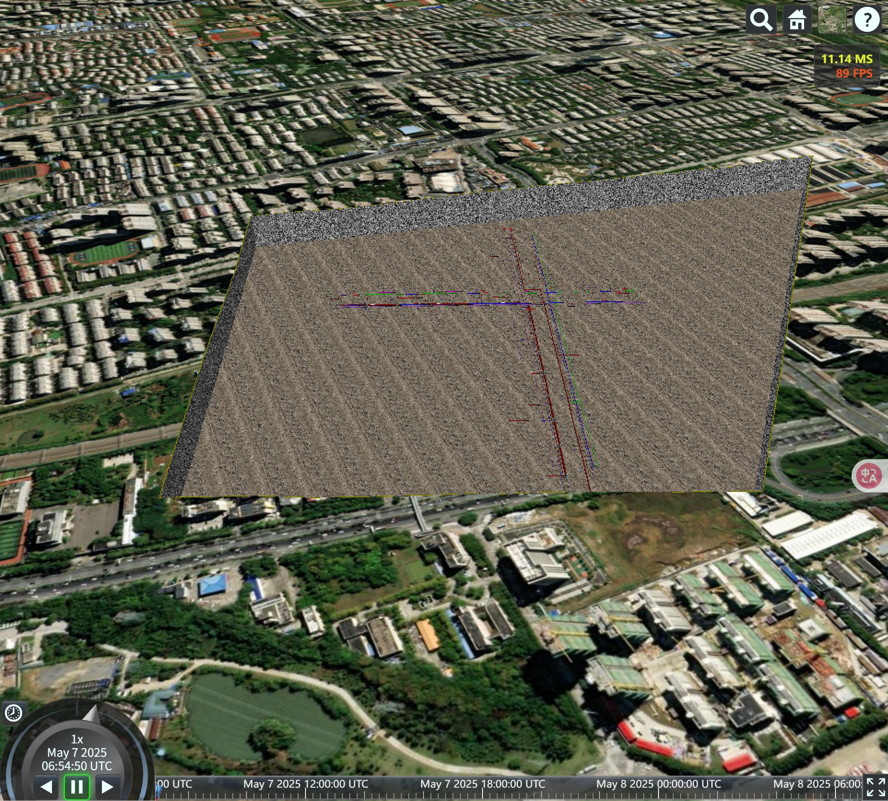

# Cesium 地形开挖

实现地形开挖，展示地下管线

## 一、实现的流程

### 1、定义挖掘区域的边界点、挖掘深度，以及周边和底部的贴图

### 2、根据边界点，获取当前集合点的走向（判断是逆时针还是顺时针）

### 3、循环计算获取当前点和下一个点的中心点，根据向量获取叉积，从而获取裁剪面

### 4、创建底部多边形实体，构建挖掘区域的底面挖掘面实体

### 5、判断当前球面是否有加载地形，从而走不同的方法

### 6、根据闭合的坐标串，获取设定数量的插值弧度点（用于地形采样获取高程）以及角度点集合（用于绘制wall墙面）

## 二、实现详细代码

[全部实现代码](https://github.com/HGX-DJK/ExcavateTerrain)

## 三、实现的效果

